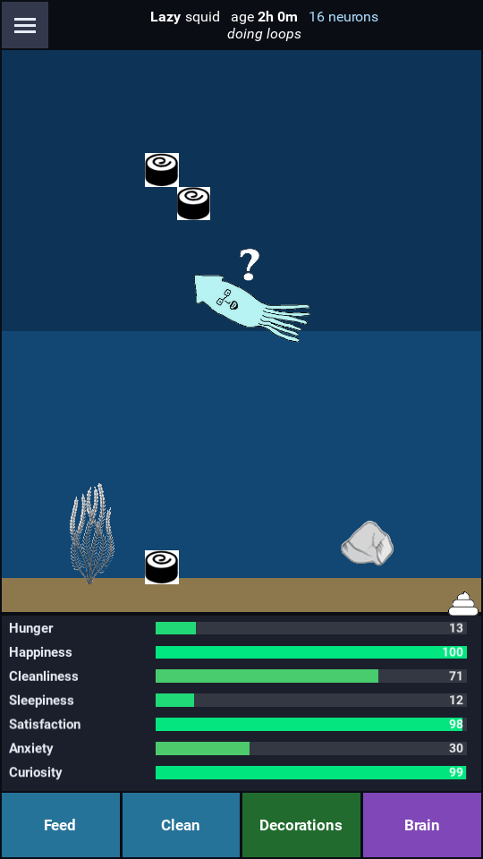
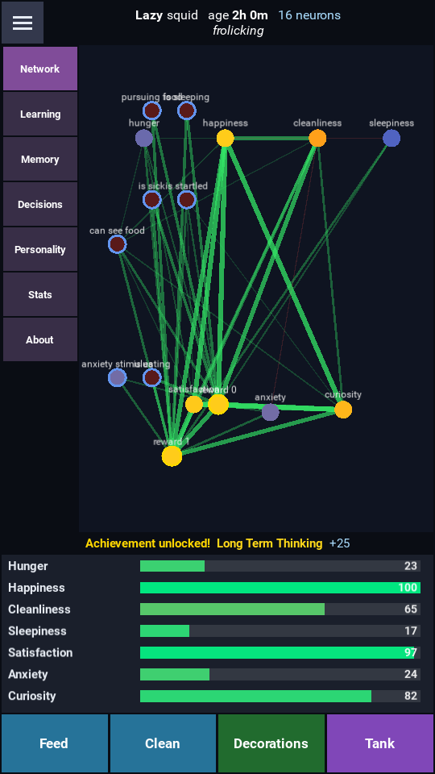
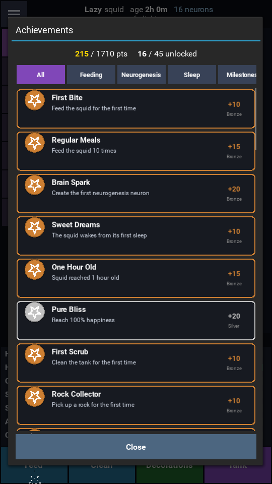
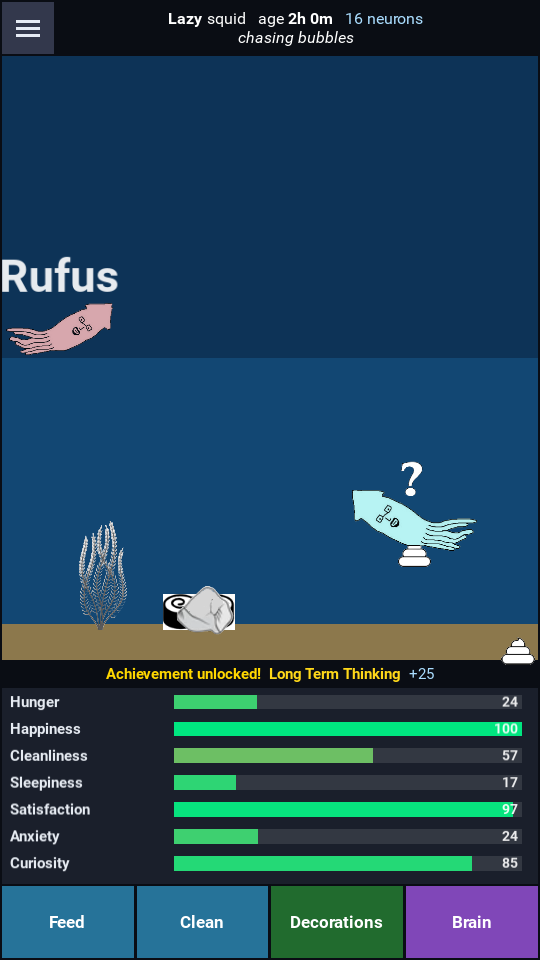

# Dosidicus Mobile (Android / Kivy port)

A touch-first Android version of **Dosidicus electronicus** — the digital pet
squid with a neural network you can *watch* think.

**The cognitive engine is the same.** Every bit of the "brain" — Hebbian
learning, STDP, neurogenesis, the dual short/long-term memory, the neural
decision engine, the seven personalities, statistics, achievements, sleep
consolidation and the save format — is the same **STRINg** core the desktop app
runs. It lives in `dosidicus_mobile/engine/` as pure Python + NumPy with **no
Qt and no Kivy**. The *only* thing rewritten for Android is the **presentation
layer**: the desktop's PyQt5 UI can't run on a phone, so the screens are
rebuilt in **Kivy**. Same squid, same mind — different skin.

You raise a squid: feed it, clean its tank, add decorations, let it play and
sleep — and its 8-neuron brain rewires itself through Hebbian learning and grows
entirely new neurons through neurogenesis. Tap **Brain** to watch every neuron
fire and every connection strengthen in real time. No two squids develop the
same way, and the whole cognitive history is saved between launches.

<p align="center">
  
  
</p>
<p align="center"><em>Tank view (raise your squid) &nbsp;·&nbsp; Brain view (watch it think — gold nodes are neurons grown by neurogenesis)</em></p>

---

## Same engine, different UI

The desktop app is ~46k lines of PyQt5. PyQt5 has no Android target, so the Qt
UI (brain widget, designer, memory tabs, plugin windows) can't ship in an APK.
What *is* portable is the cognitive core — the maths of learning, neurogenesis,
personality, memory and decision-making. So this port:

* **keeps the engine** as a clean `engine/` package that imports **only** Python
  + NumPy (no Qt, no Kivy) — same algorithms, same behaviour, same JSON save
  format as the desktop, and
* **rebuilds only the UI** in Kivy as a phone-friendly, touch-driven interface.

Because the engine is UI-agnostic it's exercised directly by the unit tests and
could be driven headless — the Kivy layer is just one consumer of it.

### How the desktop maps onto the port

| Desktop (`src/` and `plugins/`)                         | Mobile (`dosidicus_mobile/engine/`) | Notes |
|--------------------------------------------------------|-------------------------------------|-------|
| `brain_constants.py`                                    | `constants.py`   | Same 7 core neurons + sensors; positions kept on a virtual canvas so the brain view rescales to any screen. |
| `personality.py`, learning modifiers in `learning.py`   | `personality.py` | Same 7 personalities and per-personality learning/stat modifiers. |
| `learning.py` (`HebbianLearning`) + `plugins/stdp`      | `brain.py`       | `strengthen_connection`, `learn_from_*` and STDP ported; adds a continuous, framerate-independent Hebbian rule. |
| `neurogenesis.py`                                        | `brain.py`       | Novelty/stress/reward triggers grow new neurons that wire in. Runs on an internal sim clock so tests and fast-forward behave identically. |
| `memory_manager.py`                                     | `memory.py`      | Dual short/long-term memory: importance boosting, promotion, decay. |
| `decision_engine.py` (v4.0)                             | `squid.py` (`Squid.decide`) | Neural-first weighting of eat/explore/play/comfort/sleep, memory-modulated, with personality flavour. |
| `tamagotchi_logic.py` (update loop, food, startle, ink) | `simulation.py`  | Needs drift, food/poop, eating, startle + ink, rock play, cleaning sweep, save/load — the Qt scene is gone. |
| `squid_statistics.py`                                   | `statistics.py`  | Same lifetime-stat fields the desktop Statistics tab shows. |
| `plugins/achievements`                                  | `achievements.py`| The same 57 achievements (ids, tiers, points, targets). |
| `plugins/sleep_replay`                                  | `brain.py` + `memory.py` | Co-activation traces while awake; on sleep, replay strengthens links + promotes memories. |
| `plugins/multiplayer` (LAN)                             | `ui/nearby*.py`  | Reworked for phones as local peer-to-peer squid *visits* over Nearby Connections. |
| `brain_widget.py` / brain tool tabs                     | `ui/brain_screen.py`, `ui/brainview.py`, `ui/*_cards.py` | The live network + Learning/Memory/Decisions/Stats/Personality/About tabs. |

## What's in the app

* **Raising loop** — **Feed** and **Clean** buttons (a cleaning sweep wipes food
  and poop right-to-left). The squid decides for itself when to explore, play
  and sleep.
* **Egg hatching** — a new game starts as an egg that animates through its
  frames, then hatches; a short tutorial is offered.
* **Decorations** — place plants, rocks and more; **drag** to move, **pinch** to
  resize, **double-tap** to remove. Plants soothe anxiety; rocks invite play.
* **Rock play** — the squid picks up a rock, carries it, and throws it (a hard
  throw can sail out of the tank).
* **Moods & life** — sickness, **startle + ink clouds**, mental-state icons
  (startled `!`, sick, curious `?`) and a sleeping **"Zzz"**. Neglect it too
  long and it starves — **game over**. Food is capped at 5 in the tank.
* **Sleep memory consolidation** — falling asleep replays the day's strongest
  co-activations to cement them and promotes meaningful memories to long-term.
* **Change colour** — tint your squid from the About tab (persists, and travels
  with the squid).
* **The brain, fully visible** — a tabbed inspector: **Network** (pinch-zoom /
  drag-pan live graph), **Learning**, **Memory** (cards with tiny event icons),
  **Decisions** (every option scored + the winner), **Personality**, **Stats**
  (matching the desktop) and **About**. Neurons grown by neurogenesis show with
  a gold ring.
* **Achievements** — the desktop's full 57-achievement set with categories,
  tiers, points and progress; unlocks pop a toast.
* **Export / import & sharing** — see below.
* **Local peer-to-peer** — squids visit each other's tanks over Nearby
  Connections; see below.
* DPI-aware responsive layout (phone vs tablet), persistent JSON saves.

<p align="center">
  
  
</p>
<p align="center"><em>Achievements (the desktop set) &nbsp;·&nbsp; A friend's squid ("Rufus") visiting the tank over local peer-to-peer</em></p>

## Project layout

```
android/
├── main.py                      # Kivy entry point (python main.py)
├── buildozer.spec               # Android APK build config
├── requirements.txt             # desktop dev deps
├── assets/                      # squid sprites, egg frames, icons, decorations
├── java/org/vicioussquid/nearby # Java shim for Nearby Connections (P2P)
├── tests/test_engine.py         # engine unit tests (no GUI needed)
└── dosidicus_mobile/
    ├── engine/                  # PORTABLE cognitive core — no PyQt5, no Kivy
    │   ├── constants.py         # the 7 core neurons + sensors
    │   ├── personality.py       # personality types + modifiers
    │   ├── brain.py             # Hebbian + STDP + neurogenesis + sleep replay + NumPy propagation
    │   ├── memory.py            # dual short/long-term memory
    │   ├── squid.py             # needs dynamics, care actions, neural decision engine
    │   ├── statistics.py        # lifetime statistics (desktop field names)
    │   ├── achievements.py      # the 57-achievement system
    │   ├── simulation.py        # tick loop + world + visitors + save/load
    │   └── portability.py       # export/import .zip + P2P snapshots
    └── ui/                      # Kivy presentation layer (the only rewritten part)
        ├── app.py               # app shell, Clock loop, care bar, autosave, game-over
        ├── splash.py            # startup splash
        ├── tankview.py          # the aquarium: squid, food, poop, ink, visitors
        ├── brain_screen.py      # the tabbed brain inspector
        ├── brainview.py         # the live neural-network canvas
        ├── memory_cards.py / learning_cards.py / decisions_panel.py / stats.py
        ├── decorations.py       # placeable decorations (drag/pinch)
        ├── menu.py / tutorial.py / achievements_screen.py
        ├── sharing.py           # Downloads (MediaStore) + share sheet + file picker
        └── nearby.py / nearby_screen.py   # local peer-to-peer visits
```

## Sharing squids (export / import)

The hamburger menu (top-left) exports the current squid to a `.zip` in the same
8-file layout the desktop app uses (`game_state.json`, `brain_state.json`,
`statistics.json`, `ShortTerm/LongTerm.json`, `achievements.json`, `uuid.txt`,
…). On Android the file is written to the phone's public **Downloads** folder
via MediaStore — no buried app folder, no storage permission on modern Android —
and a **Share** button hands it to the system share sheet (Drive, messaging,
email, another device). **Import** opens the system document picker; choose any
squid `.zip` (yours, a friend's, or one exported from the desktop app). Mobile
exports round-trip exactly; desktop exports are imported best-effort (stats,
brain weights/positions, memories, achievements).

## Local peer-to-peer visits (Nearby Connections)

Two phones running Dosidicus can find each other over Bluetooth/Wi-Fi — no
network, no server — from the **Nearby squids** menu. One hosts, the other
finds; on connect each side sends a compact gzipped snapshot and the other
spawns it as a **guest visitor** that swims around the tank for a couple of
minutes, then leaves. A received squid can also be **imported** as a full copy.

This uses Google's **Nearby Connections** API, which is Java-only and exposes
*abstract* callbacks that pyjnius can't subclass — so a small Java shim
(`java/org/vicioussquid/nearby/`) wraps `ConnectionsClient` and forwards events
to a plain interface the Python layer implements. It requires an on-device build
with **Google Play Services** and the Bluetooth/Wi-Fi/location permissions (all
declared in `buildozer.spec`). Where the transport is unavailable (desktop, or a
build without Play Services) the screen explains why and offers a
**"Preview a visitor"** demo.

## Run on desktop (fastest way to try it)

```bash
cd android
pip install -r requirements.txt
python main.py
```

Use the care buttons and hit **Brain** to watch the network learn. Leave it
running and you'll see connections thicken and — after a few minutes of engaged
(or neglected) care — new neurons appear. (Nearby P2P is Android-only; on
desktop the Nearby screen offers the preview demo instead.)

## Run the engine tests (no display required)

```bash
cd android
python tests/test_engine.py        # or: python -m pytest tests
```

## Build the Android APK

**See [BUILDING.md](BUILDING.md) for the full step-by-step guide** (cloud build,
local Linux/WSL/macOS, deploying to a phone, and the dev loop).

Two GitHub Actions workflows build the APK on a runner with open access to
Google's SDK/NDK servers, and upload it as a downloadable artifact:

* **Debug build — [`android-build.yml`](../.github/workflows/android-build.yml).**
  Runs automatically on every push under `android/`, and can also be run from
  the Actions tab. Artifact: `dosidicus-debug-apk`.
* **Release build — [`android-release.yml`](../.github/workflows/android-release.yml).**
  **Manual only** — Actions tab → *Build Android Release APK* → **Run workflow**.
  Builds the non-debug (release) APK. If the `ANDROID_KEYSTORE_BASE64`,
  `ANDROID_KEYSTORE_PASSWORD`, `ANDROID_KEY_ALIAS` and `ANDROID_KEY_PASSWORD`
  repository secrets are set it produces a **signed, installable** APK;
  otherwise it produces an **unsigned** release APK (which must be signed before
  it can be installed). Artifact: `dosidicus-release-apk`.

Local build (Linux/WSL/macOS, downloads the SDK/NDK on first run):

```bash
cd android
pip install buildozer "Cython==0.29.37"
buildozer android debug            # debug APK -> android/bin/
buildozer android release          # release APK -> android/bin/
buildozer android deploy run logcat   # install + launch on a connected device
```

Notes:
* First build is slow (it fetches the SDK, NDK, and builds NumPy for ARM); use
  **JDK 17** — newer JDKs can break the Gradle step.
* `numpy` and `pillow` build via their python-for-android recipes, and the
  Nearby feature pulls in **Play Services** (`play-services-nearby`) with
  AndroidX enabled — all declared in `buildozer.spec`.
* Ordinary saves live in the app's private data directory; only exporting to
  Downloads (legacy Android) and Nearby (Bluetooth/Wi-Fi) use permissions.

## Design notes

* **Framerate-independent learning.** The Hebbian update and counter decay scale
  by `dt`, so a phone at 30/60 fps and the test-suite fast-forward learn at the
  same real-world rate.
* **Experience-driven neurogenesis.** New neurons are triggered by *lived*
  events — novelty (new food/decorations), reward (eating/play), and sustained
  stress (high anxiety) — not by routine ticking. An engaged squid grows
  `reward` neurons while a neglected one grows `defense` neurons.
* **Everything persists.** Stats, position, personality, colour, every weight,
  every grown neuron, memories, statistics and achievements serialise to JSON
  and reload on next launch.
